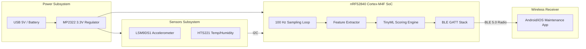
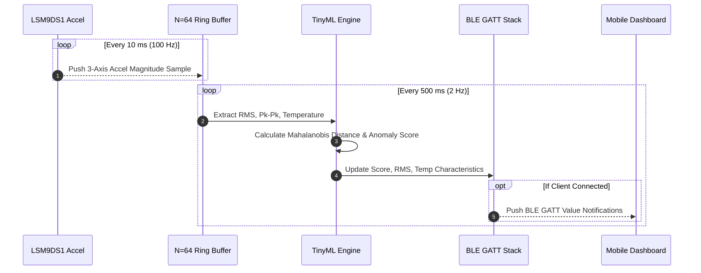

# Arduino Nano 33 BLE Sense AI - Block Diagram & Data Flow

## 1. Functional Block Interconnects

```mermaid
graph LR
    subgraph Power ["Power Subsystem"]
        VUSB["USB 5V / Battery"]
        BUCK["MP2322 3.3V Regulator"]
    end

    subgraph Sensors ["Sensors Subsystem"]
        ACCEL["LSM9DS1 Accelerometer"]
        ENV["HTS221 Temp/Humidity"]
    end

    subgraph MCUCore ["nRF52840 Cortex-M4F SoC"]
        SAMPLE_TIMER["100 Hz Sampling Loop"]
        EXTRACTOR["Feature Extractor"]
        ML["TinyML Scoring Engine"]
        GATT["BLE GATT Stack"]
    end

    subgraph External ["Wireless Receiver"]
        PHONE["Android/iOS Maintenance App"]
    end

    VUSB --> BUCK
    BUCK --> MCUCore
    BUCK --> Sensors

    Sensors -->|I2C| MCUCore
    SAMPLE_TIMER --> EXTRACTOR
    EXTRACTOR --> ML
    ML --> GATT
    GATT -->|BLE 5.0 Radio| PHONE
```

---

## 2. Real-Time Telemetry Data Flow

```mermaid
sequenceDiagram
    autonumber
    participant IMU as LSM9DS1 Accel
    participant Ring as N=64 Ring Buffer
    participant ML as TinyML Engine
    participant BLE as BLE GATT Stack
    participant App as Mobile Dashboard

    loop Every 10 ms (100 Hz)
        IMU-->>Ring: Push 3-Axis Accel Magnitude Sample
    end

    loop Every 500 ms (2 Hz)
        Ring->>ML: Extract RMS, Pk-Pk, Temperature
        ML->>ML: Calculate Mahalanobis Distance & Anomaly Score
        ML->>BLE: Update Score, RMS, Temp Characteristics
        opt If Client Connected
            BLE-->>App: Push BLE GATT Value Notifications
        end
    end
```
