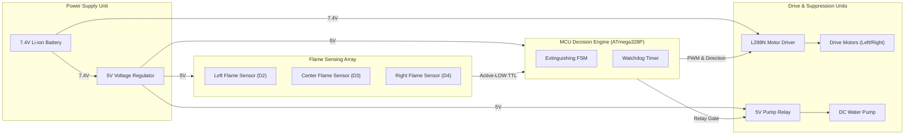
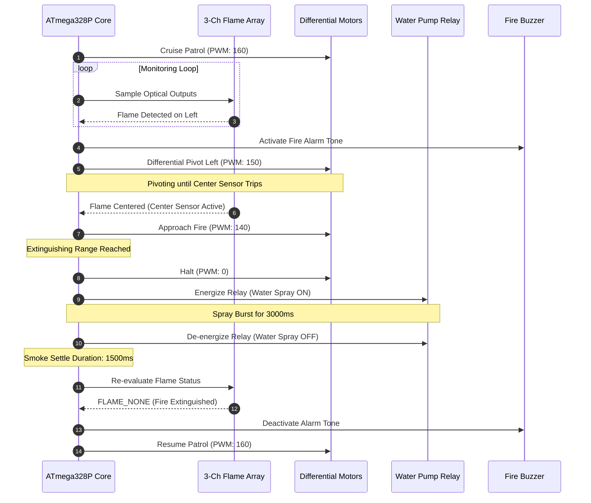

# Fire Fighting Robot - Block Diagram & Data Flow

## 1. Functional Block Interconnects

```mermaid
graph LR
    subgraph Power ["Power Supply Unit"]
        BATT["7.4V Li-ion Battery"]
        REG["5V Voltage Regulator"]
    end

    subgraph PerceptionUnit ["Flame Sensing Array"]
        IR_L["Left Flame Sensor (D2)"]
        IR_C["Center Flame Sensor (D3)"]
        IR_R["Right Flame Sensor (D4)"]
    end

    subgraph ProcessingCore ["MCU Decision Engine (ATmega328P)"]
        FSM["Extinguishing FSM"]
        PUMP_TMR["Watchdog Timer"]
    end

    subgraph Actuators ["Drive & Suppression Units"]
        L298N["L298N Motor Driver"]
        RELAY["5V Pump Relay"]
        MOT["Drive Motors (Left/Right)"]
        PUMP["DC Water Pump"]
    end

    BATT -->|7.4V| L298N
    BATT -->|7.4V| REG
    REG -->|5V| ProcessingCore
    REG -->|5V| PerceptionUnit
    REG -->|5V| RELAY

    PerceptionUnit -->|Active-LOW TTL| ProcessingCore
    ProcessingCore -->|PWM & Direction| L298N
    ProcessingCore -->|Relay Gate| RELAY
    L298N --> MOT
    RELAY --> PUMP
```

---

## 2. Real-Time Event Sequence

```mermaid
sequenceDiagram
    autonumber
    participant MCU as ATmega328P Core
    participant IR as 3-Ch Flame Array
    participant Motors as Differential Motors
    participant Relay as Water Pump Relay
    participant Alarm as Fire Buzzer

    MCU->>Motors: Cruise Patrol (PWM: 160)
    loop Monitoring Loop
        MCU->>IR: Sample Optical Outputs
        IR-->>MCU: Flame Detected on Left
    end

    MCU->>Alarm: Activate Fire Alarm Tone
    MCU->>Motors: Differential Pivot Left (PWM: 150)
    Note over MCU,Motors: Pivoting until Center Sensor Trips
    IR-->>MCU: Flame Centered (Center Sensor Active)
    MCU->>Motors: Approach Fire (PWM: 140)
    Note over MCU: Extinguishing Range Reached
    MCU->>Motors: Halt (PWM: 0)

    MCU->>Relay: Energize Relay (Water Spray ON)
    Note over MCU,Relay: Spray Burst for 3000ms
    MCU->>Relay: De-energize Relay (Water Spray OFF)

    Note over MCU: Smoke Settle Duration: 1500ms
    MCU->>IR: Re-evaluate Flame Status
    IR-->>MCU: FLAME_NONE (Fire Extinguished)
    MCU->>Alarm: Deactivate Alarm Tone
    MCU->>Motors: Resume Patrol (PWM: 160)
```
