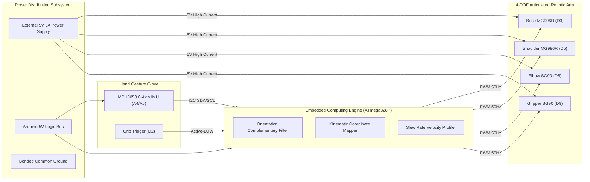
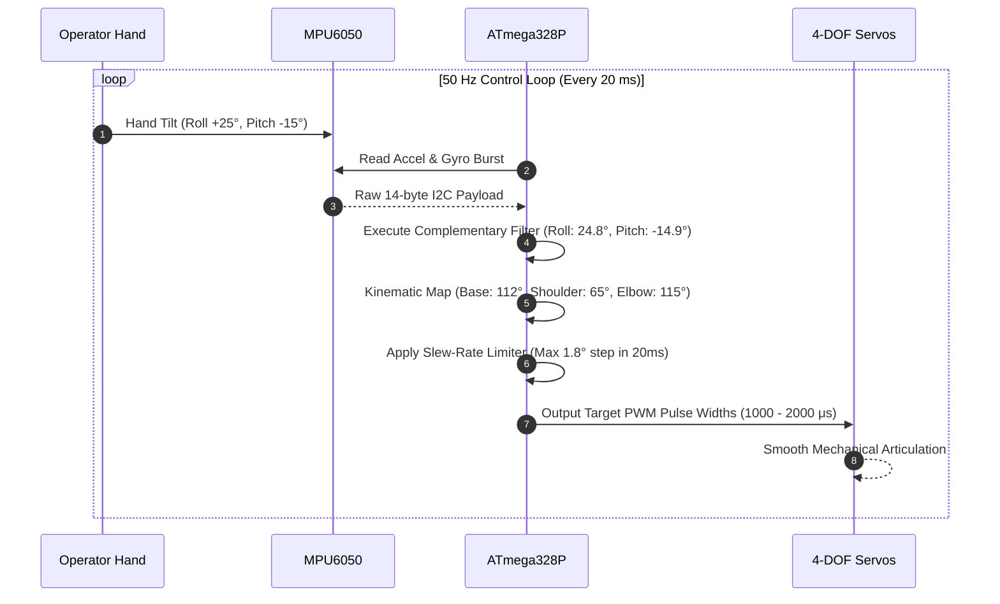

# Gesture Controlled Robotic Arm - Block Diagram & Data Flow

## 1. Functional Block Interconnects

```mermaid
graph LR
    subgraph PowerRail ["Power Distribution Subsystem"]
        EXT_5V["External 5V 3A Power Supply"]
        USB_5V["Arduino 5V Logic Bus"]
        GND["Bonded Common Ground"]
    end

    subgraph OperatorInterface ["Hand Gesture Glove"]
        MPU["MPU6050 6-Axis IMU (A4/A5)"]
        BTN["Grip Trigger (D2)"]
    end

    subgraph ControllerCore ["Embedded Computing Engine (ATmega328P)"]
        COMP["Orientation Complementary Filter"]
        KIN["Kinematic Coordinate Mapper"]
        SLEW["Slew Rate Velocity Profiler"]
    end

    subgraph RoboticArm ["4-DOF Articulated Robotic Arm"]
        S1["Base MG996R (D3)"]
        S2["Shoulder MG996R (D5)"]
        S3["Elbow SG90 (D6)"]
        S4["Gripper SG90 (D9)"]
    end

    EXT_5V -->|5V High Current| S1
    EXT_5V -->|5V High Current| S2
    EXT_5V -->|5V High Current| S3
    EXT_5V -->|5V High Current| S4

    USB_5V --> ControllerCore
    USB_5V --> MPU

    MPU -->|I2C SDA/SCL| ControllerCore
    BTN -->|Active-LOW| ControllerCore

    ControllerCore -->|PWM 50Hz| S1
    ControllerCore -->|PWM 50Hz| S2
    ControllerCore -->|PWM 50Hz| S3
    ControllerCore -->|PWM 50Hz| S4
```

---

## 2. Real-Time Gesture Mapping Data Flow

```mermaid
sequenceDiagram
    autonumber
    participant Hand as Operator Hand
    participant IMU as MPU6050
    participant MCU as ATmega328P
    participant Servos as 4-DOF Servos

    loop 50 Hz Control Loop (Every 20 ms)
        Hand->>IMU: Hand Tilt (Roll +25°, Pitch -15°)
        MCU->>IMU: Read Accel & Gyro Burst
        IMU-->>MCU: Raw 14-byte I2C Payload
        MCU->>MCU: Execute Complementary Filter (Roll: 24.8°, Pitch: -14.9°)
        MCU->>MCU: Kinematic Map (Base: 112°, Shoulder: 65°, Elbow: 115°)
        MCU->>MCU: Apply Slew-Rate Limiter (Max 1.8° step in 20ms)
        MCU->>Servos: Output Target PWM Pulse Widths (1000 - 2000 μs)
        Servos-->>Servos: Smooth Mechanical Articulation
    end
```
