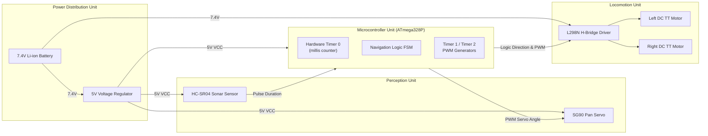

# Object Avoiding Robot - Functional Block Diagram

```mermaid
graph LR
    subgraph PowerSystem ["Power Distribution Unit"]
        BAT["7.4V Li-ion Battery"]
        REG["5V Voltage Regulator"]
    end

    subgraph Perception ["Perception Unit"]
        US["HC-SR04 Sonar Sensor"]
        SERVO["SG90 Pan Servo"]
    end

    subgraph ProcessingUnit ["Microcontroller Unit (ATmega328P)"]
        TIMER["Hardware Timer 0\n(millis counter)"]
        FSM["Navigation Logic FSM"]
        PWM["Timer 1 / Timer 2\nPWM Generators"]
    end

    subgraph LocomotionUnit ["Locomotion Unit"]
        L298N["L298N H-Bridge Driver"]
        MOT_L["Left DC TT Motor"]
        MOT_R["Right DC TT Motor"]
    end

    BAT -->|7.4V| L298N
    BAT -->|7.4V| REG
    REG -->|5V VCC| ProcessingUnit
    REG -->|5V VCC| US
    REG -->|5V VCC| SERVO

    US -->|Pulse Duration| ProcessingUnit
    ProcessingUnit -->|PWM Servo Angle| SERVO
    ProcessingUnit -->|Logic Direction & PWM| L298N
    L298N --> MOT_L
    L298N --> MOT_R
```
