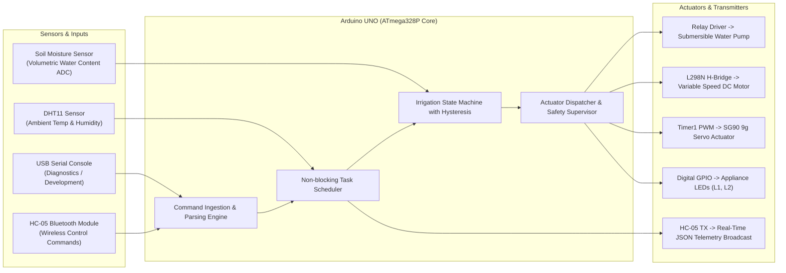

# Functional Block Diagram

**Project:** Smart Home Automation with Bluetooth & Closed-Loop Irrigation  

---

```mermaid
graph LR
    subgraph Inputs ["Sensors & Inputs"]
        BT_IN["HC-05 Bluetooth Module<br/>(Wireless Control Commands)"]
        DHT_IN["DHT11 Sensor<br/>(Ambient Temp & Humidity)"]
        SOIL_IN["Soil Moisture Sensor<br/>(Volumetric Water Content ADC)"]
        USB_IN["USB Serial Console<br/>(Diagnostics / Development)"]
    end

    subgraph Processing_Unit ["Arduino UNO (ATmega328P Core)"]
        COMM_MOD["Command Ingestion & Parsing Engine"]
        TASK_SCHED["Non-blocking Task Scheduler"]
        IRR_ENGINE["Irrigation State Machine with Hysteresis"]
        ACT_DISP["Actuator Dispatcher & Safety Supervisor"]

        COMM_MOD --> TASK_SCHED
        TASK_SCHED --> IRR_ENGINE
        IRR_ENGINE --> ACT_DISP
    end

    subgraph Outputs ["Actuators & Transmitters"]
        RELAY_OUT["Relay Driver -> Submersible Water Pump"]
        MOTOR_OUT["L298N H-Bridge -> Variable Speed DC Motor"]
        SERVO_OUT["Timer1 PWM -> SG90 9g Servo Actuator"]
        LIGHTS_OUT["Digital GPIO -> Appliance LEDs (L1, L2)"]
        BT_OUT["HC-05 TX -> Real-Time JSON Telemetry Broadcast"]
    end

    BT_IN --> COMM_MOD
    USB_IN --> COMM_MOD
    DHT_IN --> TASK_SCHED
    SOIL_IN --> IRR_ENGINE

    ACT_DISP --> RELAY_OUT
    ACT_DISP --> MOTOR_OUT
    ACT_DISP --> SERVO_OUT
    ACT_DISP --> LIGHTS_OUT
    TASK_SCHED --> BT_OUT
```
