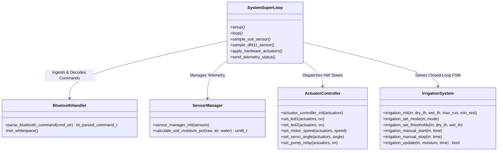

# Software Component Architecture

**Project:** Smart Home Automation with Bluetooth & Closed-Loop Irrigation  

---

```mermaid
classDiagram
    class SystemSuperLoop {
        +setup()
        +loop()
        +sample_soil_sensor()
        +sample_dht11_sensor()
        +apply_hardware_actuators()
        +send_telemetry_status()
    }

    class BluetoothHandler {
        +parse_bluetooth_command(cmd_str) bt_parsed_command_t
        -trim_whitespace()
    }

    class SensorManager {
        +sensor_manager_init(sensors)
        +calculate_soil_moisture_pct(raw, air, water) uint8_t
    }

    class ActuatorController {
        +actuator_controller_init(actuators)
        +set_led1(actuators, on)
        +set_led2(actuators, on)
        +set_motor_speed(actuators, speed)
        +set_servo_angle(actuators, angle)
        +set_pump_relay(actuators, on)
    }

    class IrrigationSystem {
        +irrigation_init(irr, dry_th, wet_th, max_run, min_rest)
        +irrigation_set_mode(irr, mode)
        +irrigation_set_thresholds(irr, dry_th, wet_th)
        +irrigation_manual_start(irr, time)
        +irrigation_manual_stop(irr, time)
        +irrigation_update(irr, moisture, time) bool
    }

    SystemSuperLoop --> BluetoothHandler : Ingests & Decodes Commands
    SystemSuperLoop --> SensorManager : Manages Telemetry
    SystemSuperLoop --> ActuatorController : Dispatches HW States
    SystemSuperLoop --> IrrigationSystem : Solves Closed-Loop FSM
```
