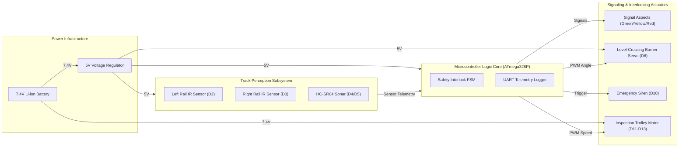
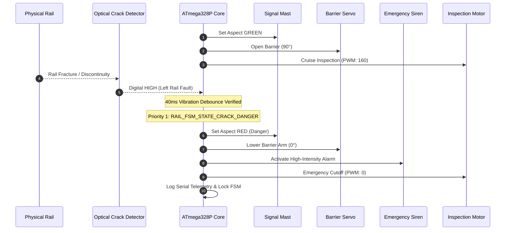

# Smart Railway Track System - Block Diagram & Data Flow

## 1. Functional Block Interconnects

```mermaid
graph LR
    subgraph PowerRail ["Power Infrastructure"]
        BATT["7.4V Li-ion Battery"]
        REG["5V Voltage Regulator"]
    end

    subgraph Perception ["Track Perception Subsystem"]
        IR_L["Left Rail IR Sensor (D2)"]
        IR_R["Right Rail IR Sensor (D3)"]
        SONAR["HC-SR04 Sonar (D4/D5)"]
    end

    subgraph ProcessingCore ["Microcontroller Logic Core (ATmega328P)"]
        FSM["Safety Interlock FSM"]
        TELEMETRY["UART Telemetry Logger"]
    end

    subgraph Actuators ["Signaling & Interlocking Actuators"]
        SIG["Signal Aspects (Green/Yellow/Red)"]
        GATE["Level-Crossing Barrier Servo (D6)"]
        SIREN["Emergency Siren (D10)"]
        TROLLEY["Inspection Trolley Motor (D11-D13)"]
    end

    BATT -->|7.4V| TROLLEY
    BATT -->|7.4V| REG
    REG -->|5V| ProcessingCore
    REG -->|5V| Perception
    REG -->|5V| GATE

    Perception -->|Sensor Telemetry| ProcessingCore
    ProcessingCore -->|Signals| SIG
    ProcessingCore -->|PWM Angle| GATE
    ProcessingCore -->|Trigger| SIREN
    ProcessingCore -->|PWM Speed| TROLLEY
```

---

## 2. Emergency Interlock Sequence Diagram

```mermaid
sequenceDiagram
    autonumber
    participant Rail as Physical Rail
    participant IR as Optical Crack Detector
    participant MCU as ATmega328P Core
    participant Signal as Signal Mast
    participant Gate as Barrier Servo
    participant Siren as Emergency Siren
    participant Trolley as Inspection Motor

    MCU->>Signal: Set Aspect GREEN
    MCU->>Gate: Open Barrier (90°)
    MCU->>Trolley: Cruise Inspection (PWM: 160)

    Rail-->>IR: Rail Fracture / Discontinuity
    IR-->>MCU: Digital HIGH (Left Rail Fault)
    Note over MCU: 40ms Vibration Debounce Verified

    Note over MCU: Priority 1: RAIL_FSM_STATE_CRACK_DANGER
    MCU->>Signal: Set Aspect RED (Danger)
    MCU->>Gate: Lower Barrier Arm (0°)
    MCU->>Siren: Activate High-Intensity Alarm
    MCU->>Trolley: Emergency Cutoff (PWM: 0)
    MCU->>MCU: Log Serial Telemetry & Lock FSM
```
