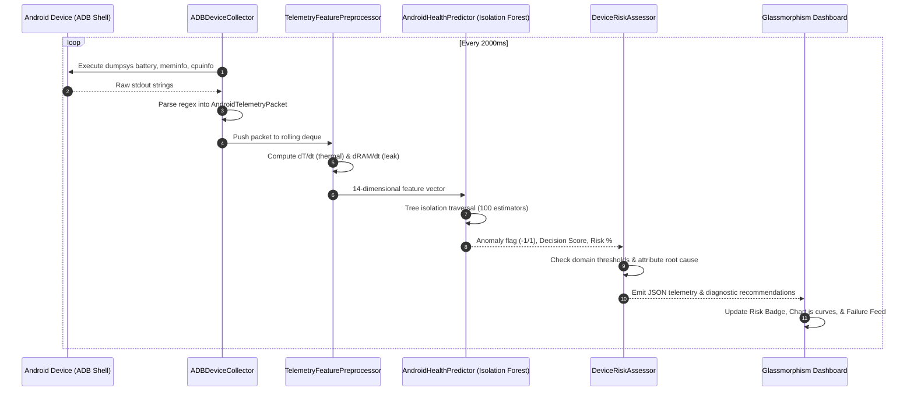

# Data Flow & Execution Sequence: Android Health AI

**Project:** Android Device Health Prediction AI  

---

```mermaid
sequenceDiagram
    autonumber
    participant Device as Android Device (ADB Shell)
    participant Collector as ADBDeviceCollector
    participant Preprocessor as TelemetryFeaturePreprocessor
    participant Predictor as AndroidHealthPredictor (Isolation Forest)
    participant Assessor as DeviceRiskAssessor
    participant WebUI as Glassmorphism Dashboard

    loop Every 2000ms
        Collector->>Device: Execute dumpsys battery, meminfo, cpuinfo
        Device-->>Collector: Raw stdout strings
        Collector->>Collector: Parse regex into AndroidTelemetryPacket
        Collector->>Preprocessor: Push packet to rolling deque
        Preprocessor->>Preprocessor: Compute dT/dt (thermal) & dRAM/dt (leak)
        Preprocessor->>Predictor: 14-dimensional feature vector
        Predictor->>Predictor: Tree isolation traversal (100 estimators)
        Predictor-->>Assessor: Anomaly flag (-1/1), Decision Score, Risk %
        Assessor->>Assessor: Check domain thresholds & attribute root cause
        Assessor-->>WebUI: Emit JSON telemetry & diagnostic recommendations
        WebUI->>WebUI: Update Risk Badge, Chart.js curves, & Failure Feed
    end
```
