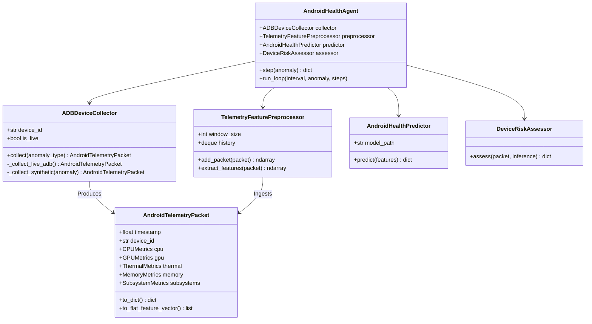

# Software Design Specification: Android Health AI

**Project:** Android Device Health Prediction AI  

---

## 1. Class and Module Relationships

```mermaid
classDiagram
    class AndroidTelemetryPacket {
        +float timestamp
        +str device_id
        +CPUMetrics cpu
        +GPUMetrics gpu
        +ThermalMetrics thermal
        +MemoryMetrics memory
        +SubsystemMetrics subsystems
        +to_dict() dict
        +to_flat_feature_vector() list
    }

    class ADBDeviceCollector {
        +str device_id
        +bool is_live
        +collect(anomaly_type) AndroidTelemetryPacket
        -_collect_live_adb() AndroidTelemetryPacket
        -_collect_synthetic(anomaly) AndroidTelemetryPacket
    }

    class TelemetryFeaturePreprocessor {
        +int window_size
        +deque history
        +add_packet(packet) ndarray
        +extract_features(packet) ndarray
    }

    class AndroidHealthPredictor {
        +str model_path
        +predict(features) dict
    }

    class DeviceRiskAssessor {
        +assess(packet, inference) dict
    }

    class AndroidHealthAgent {
        +ADBDeviceCollector collector
        +TelemetryFeaturePreprocessor preprocessor
        +AndroidHealthPredictor predictor
        +DeviceRiskAssessor assessor
        +step(anomaly) dict
        +run_loop(interval, anomaly, steps)
    }

    AndroidHealthAgent --> ADBDeviceCollector
    AndroidHealthAgent --> TelemetryFeaturePreprocessor
    AndroidHealthAgent --> AndroidHealthPredictor
    AndroidHealthAgent --> DeviceRiskAssessor
    ADBDeviceCollector --> AndroidTelemetryPacket : Produces
    TelemetryFeaturePreprocessor --> AndroidTelemetryPacket : Ingests
```
