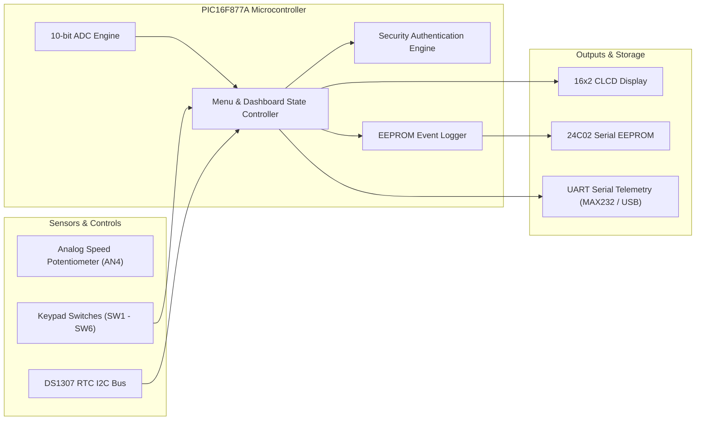

# Functional Block Diagram: Car Black Box

**Project:** Automotive Event Data Recorder  

---

```mermaid
graph LR
    subgraph Inputs ["Sensors & Controls"]
        POT["Analog Speed Potentiometer (AN4)"]
        SW["Keypad Switches (SW1 - SW6)"]
        RTC_IN["DS1307 RTC I2C Bus"]
    end

    subgraph Processing ["PIC16F877A Microcontroller"]
        ADC_CONV["10-bit ADC Engine"]
        FSM_CTRL["Menu & Dashboard State Controller"]
        PASS_AUTH["Security Authentication Engine"]
        LOG_SERIAL["EEPROM Event Logger"]

        ADC_CONV --> FSM_CTRL
        SW --> FSM_CTRL
        RTC_IN --> FSM_CTRL
        FSM_CTRL --> PASS_AUTH
        FSM_CTRL --> LOG_SERIAL
    end

    subgraph Peripherals ["Outputs & Storage"]
        LCD["16x2 CLCD Display"]
        EEPROM_OUT["24C02 Serial EEPROM"]
        UART_OUT["UART Serial Telemetry (MAX232 / USB)"]

        FSM_CTRL --> LCD
        LOG_SERIAL --> EEPROM_OUT
        FSM_CTRL --> UART_OUT
    end
```
