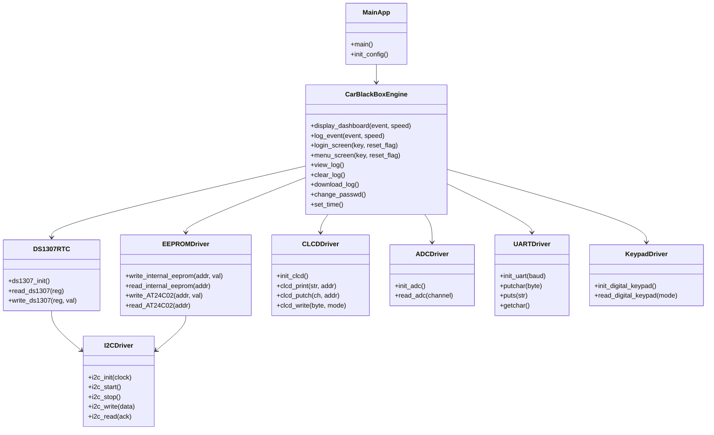

# Software Component Architecture: Car Black Box

**Project:** Automotive Event Data Recorder  

---

```mermaid
classDiagram
    class MainApp {
        +main()
        +init_config()
    }

    class CarBlackBoxEngine {
        +display_dashboard(event, speed)
        +log_event(event, speed)
        +login_screen(key, reset_flag)
        +menu_screen(key, reset_flag)
        +view_log()
        +clear_log()
        +download_log()
        +change_passwd()
        +set_time()
    }

    class I2CDriver {
        +i2c_init(clock)
        +i2c_start()
        +i2c_stop()
        +i2c_write(data)
        +i2c_read(ack)
    }

    class DS1307RTC {
        +ds1307_init()
        +read_ds1307(reg)
        +write_ds1307(reg, val)
    }

    class EEPROMDriver {
        +write_internal_eeprom(addr, val)
        +read_internal_eeprom(addr)
        +write_AT24C02(addr, val)
        +read_AT24C02(addr)
    }

    class CLCDDriver {
        +init_clcd()
        +clcd_print(str, addr)
        +clcd_putch(ch, addr)
        +clcd_write(byte, mode)
    }

    class ADCDriver {
        +init_adc()
        +read_adc(channel)
    }

    class UARTDriver {
        +init_uart(baud)
        +putchar(byte)
        +puts(str)
        +getchar()
    }

    class KeypadDriver {
        +init_digital_keypad()
        +read_digital_keypad(mode)
    }

    MainApp --> CarBlackBoxEngine
    CarBlackBoxEngine --> CLCDDriver
    CarBlackBoxEngine --> KeypadDriver
    CarBlackBoxEngine --> ADCDriver
    CarBlackBoxEngine --> UARTDriver
    CarBlackBoxEngine --> DS1307RTC
    CarBlackBoxEngine --> EEPROMDriver
    DS1307RTC --> I2CDriver
    EEPROMDriver --> I2CDriver
```
