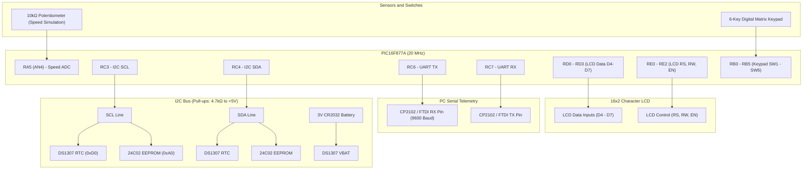

# Circuit Schematic: PIC16F877A Car Black Box

**Project:** Automotive Event Data Recorder (Car Black Box)  

---

```mermaid
graph TD
    subgraph Microcontroller ["PIC16F877A (20 MHz)"]
        RA5["RA5 (AN4) - Speed ADC"]
        RC3["RC3 - I2C SCL"]
        RC4["RC4 - I2C SDA"]
        RC6["RC6 - UART TX"]
        RC7["RC7 - UART RX"]
        RD["RD0 - RD3 (LCD Data D4-D7)"]
        RE["RE0 - RE2 (LCD RS, RW, EN)"]
        RB["RB0 - RB5 (Keypad SW1 - SW6)"]
    end

    subgraph I2C_Bus ["I2C Bus (Pull-ups: 4.7kΩ to +5V)"]
        RC3 --> SCL_Bus["SCL Line"]
        RC4 --> SDA_Bus["SDA Line"]
        SCL_Bus --> RTC_SCL["DS1307 RTC (0xD0)"]
        SDA_Bus --> RTC_SDA["DS1307 RTC"]
        SCL_Bus --> EEPROM_SCL["24C02 EEPROM (0xA0)"]
        SDA_Bus --> EEPROM_SDA["24C02 EEPROM"]
        CoinCell["3V CR2032 Battery"] --> VBAT["DS1307 VBAT"]
    end

    subgraph Display_Subsystem ["16x2 Character LCD"]
        RD --> LCD_D["LCD Data Inputs (D4 - D7)"]
        RE --> LCD_CTRL["LCD Control (RS, RW, EN)"]
    end

    subgraph Inputs_Subsystem ["Sensors and Switches"]
        Pot["10kΩ Potentiometer (Speed Simulation)"] --> RA5
        Keypad["6-Key Digital Matrix Keypad"] --> RB
    end

    subgraph Communication ["PC Serial Telemetry"]
        RC6 --> USB_RX["CP2102 / FTDI RX Pin (9600 Baud)"]
        RC7 --> USB_TX["CP2102 / FTDI TX Pin"]
    end
```
